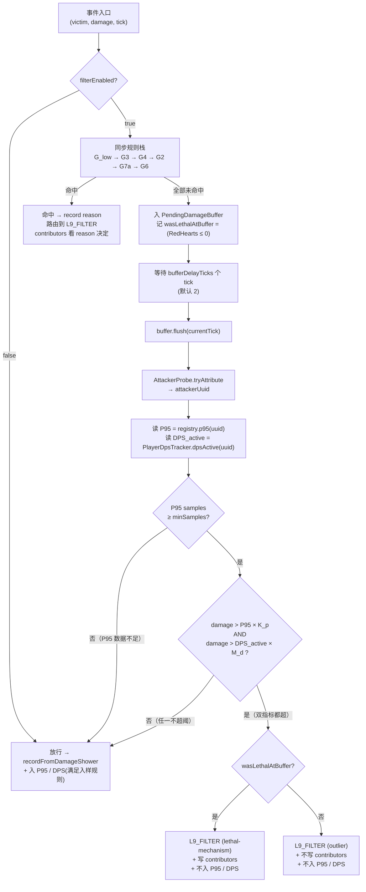

# 异常大额伤害过滤器 · 完整设计规范 V2

> **本文档定位**：v8 阶段引入的「**基于 P95 的平滑过滤**」完整设计。在 v6.7 落地的同步规则栈（G_low / G3 / G4 / G7a / G2 / G6）之上，新增 **PendingDamageBuffer 异步管线** + **per-player P95 训练（无 reset 极简版）** + **lethal-mechanism / outlier 双路由**，把过滤体系从「单事件硬阈值」演进为「单事件硬阈值 + 同玩家近期分布的统计离群点检测」。
>
> **本文取代** [DAMAGE_FILTER_DESIGN.md](DAMAGE_FILTER_DESIGN.md)（v1）。v1 文档保留作为历史参考，正文不再维护——其设计的 G7b OUTLIER（P95×K）/ PendingDamageBuffer / per-player + per-weapon / weapon-switch reset / stage-switch reset / lastFinalP95 fallback / mass-wipe G5 等子模块本设计**有选择地继承**：保留 P95 outlier + buffer + per-player + lethal/outlier 区分；**砍掉** weapon-reset、stage-reset、fallback 链、mass-wipe G5。
>
> **关联文档**：
> - [V8_SERVER_AUTHORITY_PLAN.md](V8_SERVER_AUTHORITY_PLAN.md) —— v8 服务端权威化总规划，本设计的 buffer.flush 通道与 v8 的服务端推送时序对齐
> - [异常.md](异常.md) §1 —— Sword fights on the heights 200K Damage Dealt 案例，本设计的 outlier 是终极兜底之一
> - [指令参考.md](指令参考.md) —— `/ctt-stats filter-diag` 子命令将随 P2 引入
>
> **历史教训锚点**（沿用 v1 §11，新增一条）：
> - v6.3.8 全局 HARD_CAP → 高阶 BOSS 真伤爆表，回滚
> - v6.3.10 均值×K=5 → 误伤玩家高光致死单击，回滚
> - v6.7.3 G2 状态机边界默认 true → BOSS 战合法 victim 全部被 Prop / NPC tag 误伤，回滚为默认 false
> - v6.7.4 G6 简化版重放守卫 → CTT 连发武器（nutStickLaser 等）合法连击全被误判为重放，回滚为默认 false
> - **v1 文档 K=50 + weapon-reset + stage-reset + fallback 链 → 实现复杂度过高、状态机表面积过大；本设计 K=20 + 无 reset 把状态机表面积砍到 1 个 Map 的水平**

---

## 目录

0. [文档定位 + 与 v1 的关系](#0-文档定位--与-v1-的关系)
1. [设计原则（铁律）](#1-设计原则铁律)
2. [异常源分类学](#2-异常源分类学)
3. [现状盘点](#3-现状盘点)
4. [新决策树总流程](#4-新决策树总流程)
5. [PendingDamageBuffer 详细设计](#5-pendingdamagebuffer-详细设计)
6. [PerPlayerP95Registry（极简版）](#6-perplayerp95registry极简版)
7. [lethal vs outlier 路由 + contributors 写入升级](#7-lethal-vs-outlier-路由--contributors-写入升级)
8. [配置项清单](#8-配置项清单)
9. [L9_FILTER reason 子标签现状](#9-l9_filter-reason-子标签现状)
10. [L 面板诊断子页签更新](#10-l-面板诊断子页签更新)
11. [验收用例](#11-验收用例)
12. [分阶段落地](#12-分阶段落地)
13. [与现有架构整合点](#13-与现有架构整合点)
14. [与失败教训对照](#14-与失败教训对照)
15. [修订历史](#15-修订历史)

---

## 0. 文档定位 + 与 v1 的关系

### 0.1 v1 → V2 决策矩阵

| v1 子模块 | V2 决策 | 理由 |
|---|---|---|
| G_low + Defence 豁免 + 武器白名单 | **沿用现状** | 已稳定运行 v6.7.0~v6.7.6 |
| G3 init-hp-jump 黑名单 | **沿用现状** | v6.5.2 起稳定 |
| G4 suspect-victim 关键字 | **沿用现状** | v6.5.8 起稳定 |
| G7a 物理地板 `MaxHP × 3` | **沿用现状 + 升级 contributors 写入** | 致死时改写 contributors 兜底击杀归属 |
| G2 状态机边界（paused / session-boundary / suspect-tag） | **沿用现状（默认关闭）** | 待 buffer 上线后另行评估，本设计不动 |
| G6 重放守卫 | **沿用现状（默认关闭）** | buffer 上线后可在 buffer 内拿到 attacker 维度后另行实现完整版，本设计不动 |
| **G7b OUTLIER（P95 × K）** | **本设计落地** | v1 设计但从未实装 |
| **PendingDamageBuffer** | **本设计落地** | v1 设计的 3 tick 延迟改 2 tick |
| **DPS_active 双指标 AND**（V2.1 新增） | **本设计落地** | v1 没有 DPS 维度；V2.1 用 `damage > P95×K_p AND damage > DPS_active×M_d` 把 P95 当尺子量"一刀大小"、DPS 当尺子量"一波节奏"，同时超才拦，进一步降低误伤 |
| **per-player + per-weapon** 双维度桶 | **砍 → per-player only** | 切武器不 reset，K_p=20 已宽松到能容忍同窗多武器混入；DPS_active 在停打时迅速归零，AND 关系下也能避免大部分切武器误伤 |
| **weapon-switch reset** | **砍** | 不 reset，N=100 自然衰减 |
| **stage-switch reset** | **砍** | 同上；不同关样本随窗自然滚动 |
| **lastFinalP95 fallback** + `fallbackP95Multiplier=1.5` | **砍** | 无 reset → 无 fallback 必要 |
| `lastResetReason` / `lastResetMs` | **砍** | 同上 |
| **G5 mass-wipe** | **暂不落地** | 出 V2 scope；按需另行版本评估 |
| 客户端等价过滤（v1 §12） | **占位 → 待 v9** | v8 服务端权威化已让客户端 fallback 必要性大幅降低 |

### 0.2 V2 设计哲学

> **复杂度即风险**：v1 实现 v1 §10 的 P3~P5 全套需要约 5~8 天工作量、新增 ~6 个生命周期 hook（weapon 监听 / stage 监听 / disconnect / ...）、5 个 fallback 路径。
>
> V2 把状态机表面积砍到只剩 **「per-player UUID → RollingWindow」单一 Map** + 复用现成 `PlayerDpsTracker`——无 reset、无 fallback、无 lastReset 时间戳、无 reason 枚举。代价是 K_p 取 20（不是 50）以容忍 weapon 混入；收益是 P2 一个版本就能稳定上线，无需 P3~P7 串联。

### 0.3 V2.1 双指标一句话方案

> 给每个玩家记两本小本子：**P95 本**（最近 100 次单刀大小）+ **DPS 本**（复用 `PlayerDpsTracker`，5 秒滑窗 / 活跃秒平均）。
>
> **拦截条件**：`damage > P95 × 20`（单刀维度） **AND** `damage > DPS_active × 2`（节奏维度）——同时超过两把尺子才拦。任一不超即放行。
>
> P95 当尺子量"一刀有多大"，DPS_active 当尺子量"一波有多狠"，AND 关系让正常暴击 / 持续输出都不会误伤。被过滤的事件不入任何一本本子（防自污染）。

---

## 1. 设计原则（铁律）

| # | 铁律 | 含义 | 反例 |
|---|---|---|---|
| **R1** | **零误伤致死高光单击** | 致死单击若数值合理，无条件放行（既计伤害，又计击杀） | v6.3.10 均值×K 拦掉 BOSS 收尾 9999 |
| **R2** | **致死分两类** | 致死单击 + 数值合理 = 玩家高光（全计入）；致死单击 + 数值异常 = 机制斩杀（仅计击杀人头，不计伤害） | 把所有致死无脑放行 → 机制刀污染玩家伤害账户 |
| **R3** | **不依赖单一信号** | 每条规则给出 `reason` + 多信号合议判定，避免一刀切 | v6.3.8 单看 hard cap |
| **R4** | **过滤即诊断可见** | 被过滤的事件**不进玩家账户**，但**进 L9_FILTER 桶 + 聊天栏可见**，附 reason 标签 | v6.5.1 直接 return 把回血粒子吞了 |
| **R5** | **状态/世界先于数值** | 先用 victim 状态 / 地图阶段 flag 判定，再退到数值规则 | 仅靠 damage 大小判定 |
| **R6** | **配置可关、参数可调** | 每条规则独立开关，避免一刀切回滚 | v6.3.10 只能整体回滚 |
| **R7** | **服务端 / 客户端规则集对称** | 同一异常源在双端出同样判定（归属精度差异可接受） | 双端各搞一套语义不同的过滤 |
| **R8 (V2 新)** | **复杂度即风险** | 加规则前先问"能不能用更宽的 K 替代一条 reset 链路"。每个 hook / 状态字段都要给出"砍掉之后会出什么 case"的反证 | v1 weapon-reset + lastFinalP95 fallback 链路在 P3~P7 跨 5 个版本都没全部落地 |

---

## 2. 异常源分类学

把「异常大额伤害」按**根因**分成 7 类（沿用 v1 §2，对照 V2 处置）：

| 类 | 根因 | 触发方式 | 数值特征 | V2 处置 |
|---|---|---|---|---|
| **A** | 怪物初始化 / 复活 set | `scoreboard players set @s RedHearts <N>` | 固定离散值 | G3 黑名单（沿用） |
| **B** | 形态切换 / 阶段 set | 同上但 N 浮动 | 浮动但 ≥ 当前阶段日常 P95 | G4 suspect-victim 名单（沿用）；超出 G4 名单的浮动值由 G7a + **G7b OUTLIER** 兜底 |
| **C** | 批量结算 / `kill @e` | 单 tick 内多 victim 4 层心数全清 | 极大值（接近 victim MaxHP） | G7a 物理地板（×3 MaxHP）兜底；mass-wipe 暂不实现 |
| **D** | 状态机边界 | `#PauseGame` / GameID 跳变 | 任意值 | G2 已实装但默认关闭，不在本设计动 |
| **E** | 单帧多倍 modifier 溢出 | 玩家真实暴击 + 元素叠加 | 极大但**致死** | R1 致死守门 + **G7b P95×20** 自然放行（致死且 ≤ K 倍即合法高光） |
| **F** | 数据二次记账（地图 BUG） | 同 tick 二次执行 | 与上一帧完全相同 | G6 已实装但默认关闭，不在本设计动 |
| **G** | DoT 高频小伤害噪声 | 持续燃烧 / 中毒 | 数值 < 5、每 tick 都有 | G_low 硬地板 3（沿用） |

> **V2 新增**：**E 类的"致死且超 K 倍"判定（即 lethal-mechanism）从未实装**——v1 §4.6 G7a 落地时是 P1 简化版（不写 contributors），E 类 100K+ 真伤在击杀归属上仍依赖 `VictimLethalCandidate` 兜底；V2 让 lethal-mechanism 直接通过 contributors 链路兜底。

---

## 3. 现状盘点

### 3.1 P1 已实装规则（v6.7.0 ~ v6.7.7）

代码入口位于 [server/filter/DamageFilterPipeline.java](../src/main/java/com/ctt/healthdisplay/server/filter/DamageFilterPipeline.java) 的 `applyFilters(Entity victim, int damage, long tick)`：

```68:172:saves/ctt-health-display/src/main/java/com/ctt/healthdisplay/server/filter/DamageFilterPipeline.java
public static FilterDecision applyFilters(Entity victim, int damage, long tick) {
    ServerConfig cfg = ServerConfig.INSTANCE;
    if (!cfg.filterEnabled) return FilterDecision.pass();
    if (victim == null || damage <= 0) return FilterDecision.pass();

    // G_low → G3 → G4 → G2 → G7a → G6 顺序串接
    // 任一命中即 record(reason, damage) + return FilterDecision.filter(reason)
    // 全部未命中返回 FilterDecision.pass()
}
```

| 规则 | reason | 触发条件 | 默认值 | 写 contributors |
|---|---|---|---|---|
| G_low | `low-noise` | `damage < 3` 且 `Defence ≤ 50` 且无白名单武器玩家在 16m 内 | 开 | ✗ |
| G3 | `init-hp-jump` | `damage ∈ {1000, 9000, 10000, 100000}` | 开 | ✗ |
| G4 | `suspect-victim` | victim 名含"幽匿骷髅"/"幽匿僵尸"且 `damage ≥ 800` | 开 | ✗ |
| G2 | `paused` / `session-boundary` / `suspect-tag` | 三子条件任一 | **关**（v6.7.4） | ✗ |
| G7a | `lethal-mechanism` / `oversize` | `damage > MaxHP × 3` | 开 | **✗（P1 stub，V2 改 ✓ for lethal）** |
| G6 | `duplicate` | 同 (victim, damage) 与上一 tick 重复 | **关**（v6.7.5） | ✗ |

### 3.2 P1 已禁用规则

- **G2**（v6.7.4 起 `filterStateBoundary=false` 默认禁用）：实测 BOSS 战合法 victim 被 Prop / NPC commandTag 误伤；待用户回报具体 victim 标签后另行收窄子规则。**本设计不动**。
- **G6**（v6.7.5 起 `filterDuplicateReplay=false` 默认禁用）：P1 简化版只看 `(victim, damage, tick-1)` 三元组，缺 attacker 维度，连发武器（如 `nutStickLaser`）合法连击被误判。**待 V2 buffer 上线后**，可以在 buffer 内拿到 `(victim, attacker, damage, tick)` 四元组实现完整版 G6——但**不在 V2 落地范围**，作为 V2 的 follow-up 单独评估。

### 3.3 V2 要做的新内容

1. **PendingDamageBuffer**（[§5](#5-pendingdamagebuffer-详细设计)）：所有通过同步规则栈的事件先入 buffer，延迟 N tick 后批量 flush。
2. **PerPlayerP95Registry**（[§6](#6-perplayerp95registry极简版)）：每个玩家一份 RollingWindow（N=100），记录其近期合规伤害分布，用于在 buffer.flush 时查 P95。
3. **`PlayerDpsTracker.dpsActive(uuid)`**（[§7.5](#75-dps_active-双指标-and-决策核心)）：在现有 5 秒滑窗基础上加一个新方法，按"非空桶"取平均，反映"攻击时手感"——玩家间歇打/停打时 DPS 值不被空闲秒稀释。
4. **G7b · 双指标 AND 子规则**（[§4](#4-新决策树总流程) / [§7](#7-lethal-vs-outlier-路由--contributors-写入升级)）：buffer.flush 时若 `damage > P95 × 20` **AND** `damage > DPS_active × 2`，按致死性分流到 `lethal-mechanism` / `outlier`。
5. **contributors 写入升级**（[§7.2](#72-victimdamagecontributorsadd-改造点)）：`lethal-mechanism` reason 命中时 `VictimDamageContributors.add` 仍写入；`outlier` 与其它 reason 沿用现状不写。覆盖 G7a 致死 + G7b 致死两个入口。
6. **过滤事件不入样**（[§6.2](#62-入样规则) / [§7.5](#75-dps_active-双指标-and-决策核心)）：被过滤的事件不入 P95 窗、不入 DPS 桶——防"被过滤的大数把自身阈值拉高"的恶性循环。

---

## 4. 新决策树总流程



> **同步栈（G_low ~ G6）的判定语义完全沿用现状**——本设计只在「全部同步未命中」之后插入异步管线。同步栈的规则、阈值、默认值都不动。

> **AND 短路语义**：DPS_active=0（玩家停打 ≥ 5 秒）时，DPS 阈值=0，`damage > 0` 恒成立，AND 退化为「单看 P95」——这正是停打恢复后第一发机制刀仍能被拦下的设计。

> **入样规则**：放行事件必须满足以下全部条件才进 P95 训练：
> - `attackerUuid != null`（归属成功）
> - `!wasLethalAtBuffer`（致死单击不入样，避免高光污染分布）
> - `damage ≥ lowDamageFloor`（≥ 3，避免 DoT 噪声拉低 P95）
> - `victim.Defence ≤ defenceExclusionThreshold`（≤ 50，避免高护甲怪减伤后偏低值拉低 P95）
>
> 被过滤事件（lethal-mechanism / outlier 等）**不入 P95 窗、不入 DPS 桶**——防"被过滤的大数把自身阈值拉高"的恶性循环（详见 [§6.2](#62-入样规则) / [§7.5](#75-dps_active-双指标-and-决策核心)）。

---

## 5. PendingDamageBuffer 详细设计

### 5.1 数据结构

```java
record BufferedEntry(
    UUID victimUuid,
    int victimEntityId,        // ServerWorld.getEntity 用 UUID 不快；entityId 兜底
    String worldKey,           // 跨世界场景安全
    int damage,
    long enqueueTick,
    boolean wasLethalAtBuffer  // 入队那一帧立即定格
) {}

class PendingDamageBuffer {
    // 单一 Deque，FIFO 入队 / FIFO 出队（早入早 flush）
    private final ArrayDeque<BufferedEntry> queue = new ArrayDeque<>(4096);

    void enqueue(Entity victim, int damage, long tick, boolean wasLethalAtBuffer);
    void flush(MinecraftServer server, long currentTick);
    int size();   // 诊断 / L 面板
}
```

> **不按 victim 分桶**：buffer 只是延迟 + 排序媒介，不需要跨 entry 查询。单 Deque 比 `Map<UUID, List<Entry>>` 简单且快。

### 5.2 入队 / flush 时机

#### 入队

`DamageFilterPipeline.applyFilters` 全部规则未命中 → 不再返回 `FilterDecision.pass()`，改为：

```java
PendingDamageBuffer.INSTANCE.enqueue(
    victim,
    damage,
    tick,
    DamageFilterPipeline.readVictimRedHearts(victim) <= 0  // wasLethalAtBuffer
);
return FilterDecision.deferred();  // 新增枚举值，告知调用方"先别记账"
```

`FilterDecision` 增加第三态 `DEFERRED`，调用方（`DamageProbe.recordFromRedHearts`）收到 `DEFERRED` 时**跳过本次的 AttackerProbe.recordFromDamageShower 调用**——记账由 buffer.flush 统一负责。

#### Flush

```java
void flush(MinecraftServer server, long currentTick) {
    int delay = ServerConfig.INSTANCE.bufferDelayTicks;  // 默认 2
    while (!queue.isEmpty()) {
        BufferedEntry head = queue.peekFirst();
        if (currentTick - head.enqueueTick() < delay) break;  // 还没等够，停扫
        queue.pollFirst();
        processEntry(server, head, currentTick);
    }
}
```

`processEntry` 完成 §4 决策树异步部分：tryAttribute → P95 查询 → outlier / lethal 分流 → 调用 `AttackerProbe.recordFromDamageShower(...)`。

> **为什么 FIFO 一次扫完即可**：所有 entry 的 `enqueueTick` 单调非递减（同一服务端线程入队），头部满足条件就一定是最早的；遇到第一个不满足条件的就停扫。O(出队数) 复杂度，无 sweep 浪费。

#### 调用顺序（关键）

`DamageProbe.flushTick` 的末尾插入 buffer.flush，与既有的 `VictimTombstone.scanDeaths()` 顺序协调：

```java
public static void flushTick(MinecraftServer server) {
    long tick = currentTick.incrementAndGet();
    // === 既有 ===
    while ((ev = pending.poll()) != null) { /* 处理 DamageShower 粒子线 */ }

    // === V2 新增 ===
    VictimTombstone.scanDeaths(server, tick);          // 1. 先扫死亡，让 contributors 被结算
    PendingDamageBuffer.INSTANCE.flush(server, tick);  // 2. 再 flush buffer，新写入的 contributors
                                                       //    会留待下次 scanDeaths 触发击杀归属
}
```

> **顺序敏感性**：scanDeaths 必须在 flush 之前。flush 写入的 contributors 是为「下次」死亡服务的——这一帧 victim 已经死了，它的 contributors 已经在 scanDeaths 里被消费过；flush 写入的新 contributors 不会丢失（写入到对应 victim 的 contributor 表后，该 victim 下次再死时仍能取到）。**写到已死 victim 的 contributors 表是良性的**：tombstone 已经把击杀归属做完了，新写入的不被消费就被 GC。

### 5.3 wasLethalAtBuffer 致死定格

定义：`wasLethalAtBuffer` 在**入队那一帧**通过 `victim.RedHearts <= 0` 立即计算并固化到 entry 字段。flush 时**不重读** RedHearts。

#### 为什么入队时定格而不是 flush 时再读

| 选项 | 优点 | 缺点 |
|---|---|---|
| 入队定格（V2 选择） | 1. 不依赖 VictimTombstone race；2. 即使 IronHeart 在 2 tick 内复活 victim，本次伤害仍按致死处理（接受） | victim 在 2 tick 内被复活的极少数情况下，伤害"被错判致死" → 不计入伤害账户。代价小 |
| flush 时重读 | 准确反映"buffer flush 时的致死状态" | 需要 victim 存活以读 RedHearts；victim 已被 GC / removed 时无法判定，需要兜底逻辑 |

> **V2 选择入队定格的根本理由**：`ScoreboardUpdateMixin` 用 `@At("RETURN")` 注入，意味着 `recordFromRedHearts` 调到 buffer.enqueue 时 RedHearts 计分板**已经更新为新值**（即扣血后的当前值）。读 ≤ 0 即视为本次受击致死——这是已经过 v6.6.x ~ v6.7.x 实测验证的语义，沿用即可。

### 5.4 buffer 容量与溢出策略

| 配置 | 默认 | 含义 |
|---|---|---|
| `bufferMaxSize` | 4096 | Deque 容量上限。CTT 高强度战斗约 200 events/s，4096 ≈ 20 秒余量 |

溢出（`size() >= bufferMaxSize`）时丢**最老**的 entry：

```java
if (queue.size() >= ServerConfig.INSTANCE.bufferMaxSize) {
    queue.pollFirst();  // 丢最老
    overflowDropped.incrementAndGet();
}
queue.addLast(entry);
```

理由：

- 最老的 entry 已经等了较久（≥ delay），它的 victim 大概率已经 GC，重攻击者归属命中率最低
- 最新的 entry 才是「玩家正在感受到」的伤害；丢最新会让"刚打的怪"看起来没伤害

`overflowDropped` 计数曝露给 [§10](#10-l-面板诊断子页签更新) 的诊断子页签——溢出本身在正常游戏不该发生，看到非零数即调参信号。

---

## 6. PerPlayerP95Registry（极简版）

### 6.1 数据结构

```java
class RollingWindow {
    static final int CAPACITY = 100;          // ServerConfig.p95WindowSize
    final ArrayDeque<Integer> insertionOrder = new ArrayDeque<>(CAPACITY);
    final int[] sortedArray = new int[CAPACITY];
    int sortedSize = 0;

    void observe(int damage) {
        if (insertionOrder.size() == CAPACITY) {
            int oldest = insertionOrder.pollFirst();
            int idx = Arrays.binarySearch(sortedArray, 0, sortedSize, oldest);
            // 移除该位置（System.arraycopy 左移）
            ...
            sortedSize--;
        }
        insertionOrder.addLast(damage);
        // 二分定位插入位置 + 右移
        int pos = ...;
        sortedSize++;
    }

    int p95() {
        if (sortedSize < ServerConfig.INSTANCE.p95MinSamples) return -1;
        int idx = (int) Math.ceil(sortedSize * 0.95) - 1;  // 100 样本 → idx=94
        return sortedArray[idx];
    }

    int size() { return insertionOrder.size(); }
}

class PerPlayerP95Registry {
    private final Map<UUID, RollingWindow> windows = new ConcurrentHashMap<>();

    void observe(UUID attackerUuid, int damage);  // 满足入样规则时调
    int p95(UUID attackerUuid);                    // 不存在或样本不足返回 -1
    void evict(UUID attackerUuid);                 // DISCONNECT hook
    int sampleCount(UUID attackerUuid);            // L 面板用
}
```

性能：100 元素 `int[]` 二分定位 + `arraycopy`，单次 observe O(N)；CTT 高强度战斗约 200 events/s × 4 玩家 = 800 ops/s，每 op ~50 ns，**总开销 ~40 μs/s**——可忽略。

内存：单玩家 ≈ 1 KB（`int[100]` + `ArrayDeque<Integer> 100 boxes`，约 200 bytes 真实开销 + JVM overhead）。100 在线玩家 ≈ 100 KB。

### 6.2 入样规则

放行事件（即 buffer.flush 判定为「未触发 outlier / lethal-mechanism」）必须满足以下**全部**才入样：

| 条件 | 理由 |
|---|---|
| `attackerUuid != null` | 归属失败的事件无法挂到任何玩家窗口 |
| `!wasLethalAtBuffer` | 致死高光不该污染日常分布（R1 致死守门的副产物） |
| `damage ≥ lowDamageFloor`（≥ 3） | DoT / 反伤 1~2 点不入样，避免拉低 P95 |
| `victim.Defence ≤ defenceExclusionThreshold`（≤ 50） | 高护甲怪减伤后输出偏低，会人为拉低 P95；伤害仍计入玩家账户但**不入样** |

未通过任一条件 → 事件正常放行 + 不入样。

**被过滤事件不入样**（V2.1 强调）：任何被路由到 `L9_FILTER` 的事件——含 `low-noise / init-hp-jump / suspect-victim / paused / session-boundary / suspect-tag / oversize / lethal-mechanism / duplicate / outlier`——**全部不调** `registry.observe()`。理由：

- 异常大数若进窗口会**把自身阈值拉高**，下次同等异常就漏过 → 恶性循环
- 低伤噪声若进窗口会**拉低 P95**，让阈值过紧 → 误伤合法伤害

> 入样守门一句话：**「被过滤的不入样」。** P95 窗口只反映**真正的合法日常输出**分布。

> 同样地，被过滤事件**也不进 `PlayerDpsTracker.onDealt`**，避免 DPS_active 被异常大数污染。详见 [§7.5](#75-dps_active-双指标-and-决策核心)。

### 6.3 不 reset 的论证 + 取舍

#### 论证

V2 最大的简化是「**完全不 reset**」——不监听武器切换、不监听关卡切换、不监听玩家加入。每个 UUID 一个 RollingWindow，从首次 observe 起永续滑动，N=100 自然衰减。

> **"切武器后 P95 是不是就错了？"** ——是的，但**错的方向是变宽**：
>
> 例：玩家从普通铁剑（P95≈200）切到神器激光（P95≈3000）。窗内前 50 样本仍是铁剑数据。新激光打 5000 点 → 当前 P95 仍约 200~500（因为大半样本是铁剑）→ 阈值 = 500 × 20 = 10000 → 5000 不会被误判 outlier。
>
> 反过来，激光切回铁剑：窗内仍混有激光数据 → P95 ≈ 3000 → 阈值 = 60000 → 铁剑伤害 200 当然完全放行。
>
> **永不会错的方向**：切武器只会让阈值「变宽」，永远不会让合法伤害被误过滤。

#### 取舍

| 场景 | V2 行为 | 代价 |
|---|---|---|
| 玩家从神器切到菜刀，即时打 100 点 | 阈值仍按神器 P95 算（≈60000）→ 100 必放行 | 无 |
| 玩家从菜刀切到神器，神器首击 5000 点 | 窗内仍以菜刀样本为主，P95 ≈ 200~500 → 阈值 10000 → 5000 放行 | 无 |
| 难关（P95≈3000）切到简单关，简单关一只小怪掉 100 | 阈值仍按 P95=3000 算 = 60000 → 100 放行 | 无（同上） |
| 简单关（P95≈80）切到难关，BOSS 一击爆炸打 6000 | 窗内仍以简单关样本为主，P95 ≈ 80~200 → 阈值 1600~4000 → **6000 可能被误过滤为 outlier** | **真实存在**——切关后前 ~30 秒（窗滚到一半）的高难度真伤可能误伤 |

#### 切关后误伤的兜底（V2.1 双指标 AND 大幅缓解）

切关后样本仍是旧关数据，**双指标 AND + G7a 物理地板** 三层兜底：

- 新关 BOSS MaxHP 通常远大于旧关 → G7a 阈值（MaxHP × 3）自然变宽
- **DPS 维度提供新保险**：玩家在新关持续输出 → DPS_active 立即反映新关节奏 → AND 关系下需要 P95 维度也命中才拦

> **V2.0 反例（单 P95 时代）**：简单关 P95=80，新关玩家打 6000 真伤，K_p=20 → P95 阈值 1600 → 6000 > 1600 → **被 outlier 拦截**（V2.0 真实存在的误伤）。
>
> **V2.1 双指标修正**：同样场景下 DPS_active 假设 = 3000（新关持续输出节奏），M_d=2 → DPS 阈值 = 6000 → `6000 > 6000`? 否 → AND 不命中 → **正常放行** ✓
>
> 双指标 AND 把"切关误伤"代价从 V2.0 的"切关瞬间高数值真伤被拦"压缩到几乎不存在——除非玩家既切关又**单刀异常爆发**（同时超 P95×20 和 DPS×2），此时确实是 outlier。

> **极端反例**：新关首次出场单刀 6000，DPS_active=0（刚切关 5 秒内无累积）→ DPS 阈值 = 0 → `damage > 0` 必成立 → 退化到单 P95 → P95 阈值 1600 → 6000 > 1600 → 拦截。
>
> 此 case 仍存在但概率低（要切关 5 秒内首发就打异常大数，且无 G7a 物理地板兜底）。**接受这个剩余代价**——R8 复杂度铁律不允许引入 stage-switch reset。

### 6.4 minSamples 期间的 fallback 链路

新玩家首次进服 / 服务端重启后样本 < `p95MinSamples`（默认 20）期间：

- `registry.p95(uuid)` 返回 `-1` → P95 维度判定跳过
- AND 关系下 P95 缺失即降级 → buffer.flush 直接走"放行"分支
- 异常伪伤害靠**G7a 物理地板**（damage > MaxHP × 3 → lethal-mechanism / oversize）兜底

CTT 普通战斗 20 个事件大约 ~3 秒积累完成；BOSS 单挑稍慢但 < 30 秒。这段窗口内的攻击：

- DoT 1~2 点伤害仍被 G_low 切除
- 黑名单值（1000/9000/10000/100000）仍被 G3 切除
- 幽匿骷髅 / 僵尸 ≥800 仍被 G4 切除
- damage > MaxHP × 3 仍被 G7a 切除

**仅"超过 G7a 但不超 P95 × K 范围、且非 G3/G4 黑名单"的中段异常值**（如 BOSS 真伤合法 8000、但属于「超出该玩家日常」的离群点）会在 minSamples 未满期间漏过。这一段漏过的代价是「玩家伤害账户偶尔被 +8000」，远低于 v1 §5.3 fallback 链路的实现成本。

---

## 7. lethal vs outlier 路由 + contributors 写入升级 + 双指标 AND

### 7.1 路由规则

buffer.flush 触发 [§7.5 双指标 AND](#75-dps_active-双指标-and-决策核心)（`damage > P95×K_p AND damage > DPS_active×M_d`）时按 `wasLethalAtBuffer` 分两路：

| 条件 | reason | 写 contributors? | 玩家账户 |
|---|---|---|---|
| `wasLethalAtBuffer == true` | `lethal-mechanism` | **✓ 写入**（由 V2 升级） | 不计入伤害账户；击杀仍由 contributors → tombstone 路径归属玩家 |
| `wasLethalAtBuffer == false` | `outlier` | ✗ 不写入 | 不计入伤害账户；非致死所以也无击杀归属问题 |

同时**升级 G7a**（同步路径）：

| 条件 | reason | 现状 | V2 行为 |
|---|---|---|---|
| `damage > MaxHP × 3` 且致死 | `lethal-mechanism` | 不写 contributors（P1 stub） | **✓ 写 contributors** |
| `damage > MaxHP × 3` 非致死 | `oversize` | 不写 | ✗ 不写（沿用） |

### 7.2 VictimDamageContributors.add 改造点

[server/VictimDamageContributors.java](../src/main/java/com/ctt/healthdisplay/server/VictimDamageContributors.java) 的 `add(...)` 当前在 `forceLayer == L9_FILTER` 时跳过写入。V2 需要：

1. 调用方把 `FilterReason` 枚举传到 `add(...)` 而不是只传 `forceLayer`
2. `add(...)` 内部判定 `reason == FilterReason.LETHAL_MECHANISM` → 走正常写入路径；其它 reason 仍跳过

具体改动顺路链：

```
DamageFilterPipeline.applyFilters
    └→ FilterDecision { filtered, reason }   // 已有

DamageProbe.recordFromRedHearts
    └→ AttackerProbe.recordFromDamageShower(... forceLayer, FilterReason reason)   // V2 新签名
        └→ VictimDamageContributors.add(... FilterReason reason)                    // V2 新签名

PendingDamageBuffer.flush.processEntry
    └→ AttackerProbe.recordFromDamageShower(... forceLayer = L9_FILTER, reason = LETHAL_MECHANISM 或 OUTLIER)
```

[server/AttackerProbe.java](../src/main/java/com/ctt/healthdisplay/server/AttackerProbe.java) 当前 7-arg 重载（v6.7.4 引入）：

```404:407:saves/ctt-health-display/src/main/java/com/ctt/healthdisplay/server/AttackerProbe.java
public static void recordFromDamageShower(MinecraftServer server, Entity victim,
                                          ServerWorld victimWorld, int damage, long tick,
                                          Layer forceLayer, String filterReasonTag) {
```

V2 增加第 8 个参数 `FilterReason reason` 或者把 `String filterReasonTag` 替换为 `FilterReason reason`（直接传枚举更类型安全；shortTag 可在 add() 内取）。建议：

```java
public static void recordFromDamageShower(MinecraftServer server, Entity victim,
                                          ServerWorld victimWorld, int damage, long tick,
                                          Layer forceLayer, FilterReason reason) {
    String tag = (reason != null) ? reason.shortTag() : null;
    // 内部仍用 tag 拼 detail；reason 透传给 contributors.add
    ...
}
```

并保留 7-arg 重载（接 `String filterReasonTag`）作为 deprecated 兼容入口，转发到新 8-arg 实现。

### 7.3 验收：T14 / T15 案例数据流

#### T14 · 小吃货机制斩杀 103950 致死

```
玩家 Kirin0321 在 tick T-2 用普通武器打小吃货 140 点（普通归属）
    → 经过 G_low/G3/G4/G7a/G6 全部未命中
    → 入 buffer (140, T-2, wasLethalAtBuffer=false)
    → buffer 未到 delay 不 flush
    → 同时 AttackerProbe.recordFromDamageShower 走的是 v8.x 老路径...

WAIT —— 这里有个问题：V2 改了路径后，140 这条事件应该是 buffer.flush 时 (在 T) 才记账，
        但 T-2 写入 contributors 的 140 已经被 flush 处理了吗？

✓ 答：T-2 入队的 140 在 T 时（delay=2）出队，flush 调 AttackerProbe.recordFromDamageShower(..., reason=null)
      → contributors.add(... reason=null) 命中"非过滤路径"分支正常写入 → contributors[小吃货][Kirin0321] += 140
   (注：flush 时序是 scanDeaths → flush，scanDeaths 在 T 还没看到死亡)

tick T 地图脚本 set RedHearts=-103950
    → ScoreboardUpdateMixin 拦到 RedHearts delta 下降
    → DamageProbe.recordFromRedHearts(server, holder=小吃货, damage=103950, tick=T)
    → DamageFilterPipeline.applyFilters
        → G_low? damage=103950 ≥ 3 跳过
        → G3? not 1000/9000/10000/100000 跳过
        → G4? "小吃货" 不在 suspectVictims 跳过
        → G2? 默认关闭
        → G7a? MaxHP=500, damage=103950, threshold=1500. damage > 1500.
              → wasLethal = victim.RedHearts ≤ 0 → true → reason = LETHAL_MECHANISM
              → return FilterDecision.filter(LETHAL_MECHANISM)
    → DamageProbe 看到 decision.filtered() == true && reason == LETHAL_MECHANISM
    → 调 AttackerProbe.recordFromDamageShower(... forceLayer=L9_FILTER, reason=LETHAL_MECHANISM)
        → 内部:
          - PlayerDamageStats.add 跳过（forceLayer==L9_FILTER）→ 伤害不计入
          - VictimDamageContributors.add 命中 LETHAL_MECHANISM 分支 → contributors[小吃货][Kirin0321] += 103950
              （注：实际写入的是 attackerUuid 而非数值贡献的细节；本表只为说明 contributors 仍有 Kirin0321）
        → 聊天广播 "[L9-FILT:lethal-mechanism] damage=103950 victim=小吃货 → killer credit=Kirin0321"

tick T+1 VictimTombstone.scanDeaths 检测到小吃货 isRemoved
    → 取 contributors[小吃货] = {Kirin0321}（含两次写入：140 + lethal-mechanism 那一笔）
    → PlayerKillStats.kill(Kirin0321, 小吃货) → Kirin0321 +1 击杀
```

**结果**：Kirin0321 击杀 +1，伤害账户 +140（不含 103950），完全符合 R2 铁律。

#### T15 · 玩家 A 打 50 点后机制致死

```
tick T-2 玩家 A 打怪 50 点（普通归属）→ buffer enqueue
tick T   buffer.flush 处理 (50, T-2, wasLethal=false)
        → tryAttribute → A
        → P95 假设 80, threshold = 80 × 20 = 1600
        → 50 ≤ 1600 → 放行 → recordFromDamageShower(...) 正常
        → contributors[怪][A] += 1 （计数式）
        → 入样：A.window.observe(50)
        → 玩家 A 伤害账户 += 50

tick T+5 地图脚本 set RedHearts=-99999
        → G7a? MaxHP=200, threshold=600. damage=99999 > 600. wasLethal=true.
        → reason=LETHAL_MECHANISM, contributors.add(reason=LETHAL_MECHANISM)
        → contributors[怪][A] += 1 （仍是 A，因为 forceLayer=L9_FILTER 时 attacker 由调用方决定...）
        
        WAIT —— 这里有个细节：forceLayer != null 时 AttackerProbe 会跳过 attribute()，
                那 contributors 写入时用的 attacker 是谁？
        
        ✓ 答：v6.5.2 起 forceLayer 路径走的是「跳过归属，但仍要记录 victim 一侧」语义，
              即「事件本身不归属任何玩家」——所以原 P1 现状是「lethal-mechanism 不写 contributors」。
              V2 升级后，lethal-mechanism 仍要走「不归属 attacker，但 contributors 表
              上加一个轻量 marker 维持「该 victim 上次被致死时无主」」语义。具体实现：
              VictimDamageContributors.add 在 reason==LETHAL_MECHANISM 且 attackerUuid==null
              时，**不操作 contributors 表**——T15 的击杀归属仍走 A 之前 50 点写入的 contributor。

         → tombstone 触发时，contributors[怪] = {A: 1}（仅 50 那一笔贡献的 A）→ killer = A → A +1 击杀
```

> **注意 T15 与 T14 的差别**：T14 的玩家在死前没有任何普通归属伤害（机制刀直接致死），lethal-mechanism 必须主动写 contributors 才能让击杀归到玩家；T15 玩家先打过 50 点已写入 contributors，lethal-mechanism 那一笔可写可不写——为简化 add() 实现，**V2 设计 lethal-mechanism 路径需要 attacker 解析成功才写 contributors**：tryAttribute（或 G7a 同步路径下的 inline attribute）拿不到 attacker 时不写。如果 G7a 同步路径下决定不做 inline attribute（实现成本考量），则 T14 的击杀仍由更下游的 `VictimLethalCandidate` 兜底——这是 v6.7.x 现状。

> **关于 T14 中"G7a 致死走 contributors 写入"的最终决策**：
>
> 由于 G7a 是同步路径（无 buffer 延迟），调用 attribute 会立即触发完整归属逻辑（写 PlayerDamageStats、写 PlayerHitLog 等副作用）——但 lethal-mechanism 的语义是「不计入伤害」。所以 G7a 的 contributors 写入需要走「轻量纯查询」版本：
>
> - 调 `AttackerProbe.tryAttribute(victim, tick)` 仅读 attacker 身份（V2 新增方法）
> - 调 `VictimDamageContributors.add(victimUuid, attackerUuid, reason=LETHAL_MECHANISM)` 仅写 contributors 一项
> - 不调 `PlayerDamageStats.add` / `PlayerHitLog.add`
>
> 这条路径对 G7b 异步路径完全等价（buffer.flush 本来就是延迟后再 attribute）。

### 7.4 DPS_active 取值算法

V2.1 在 [server/PlayerDpsTracker.java](../src/main/java/com/ctt/healthdisplay/server/PlayerDpsTracker.java) 既有 5 秒滑窗（5 个 1 秒桶环形缓冲）的基础上新增方法 `dpsActive(uuid)`：

```java
public static long dpsActive(UUID uuid) {
    DpsRing r = RING.get(uuid);
    return r == null ? 0L : r.dpsActive(System.currentTimeMillis());
}

class DpsRing {
    long dpsActive(long nowMs) {
        rotateTo(nowMs / 1000L);   // 既有：滚动归零过期桶
        long sum = 0;
        int active = 0;
        for (long b : buckets) {
            if (b > 0) { sum += b; active++; }
        }
        return active == 0 ? 0L : sum / active;
    }
}
```

**含义**：最近 5 秒累积总伤害 ÷ 这 5 秒中"有过攻击的秒数"——而不是直接除以 5（那是被空闲稀释的均值）。

| 玩家行为 | 桶状态 [t-4..t] | 现有 `recent5sSum/5` | **DPS_active** |
|---|---|---|---|
| 持续每秒打 200 | [200, 200, 200, 200, 200] | 200 | **200** |
| 间歇打（1 秒打 1 秒停） | [500, 0, 500, 0, 500] | 300 | **500** ✓ |
| 短时爆发 1 秒 5000 | [5000, 0, 0, 0, 0] | 1000 | **5000** ✓ |
| 停打 3 秒后一发 200 | [_, _, _, _, 200] | 40 | **200** |
| 停打 ≥ 5 秒 | [0, 0, 0, 0, 0] | 0 | **0** |

性能：5 个 long 比较+累加+一次除法，~10 ns。相对现有 `recent5sSum` 几乎零开销。

**关键性质**：
- 玩家停打 ≥ 5 秒时 DPS_active=0 → 阈值 = 0 → `damage > 0` 必成立 → AND 退化为单 P95
- 玩家间歇打时 DPS_active 反映"出手秒"的真实节奏，不被空闲秒拉低
- 单秒大额爆发后 DPS_active 直接等于该秒总和，下次再来同等大额自然不算 outlier（合法连续暴击的保护）

### 7.5 DPS_active · 双指标 AND 决策核心

**这是 V2.1 G7b 的最终判定逻辑**。在 buffer.flush 的 `processEntry` 内调用：

```java
boolean shouldFilterOutlier(BufferedEntry entry, UUID attackerUuid) {
    if (attackerUuid == null) return false;        // 归属失败 → G7a 兜底

    int p95 = registry.p95(attackerUuid);          // < minSamples 时返回 -1
    if (p95 <= 0) return false;                    // P95 数据不足 → 放行（降级 1）

    long dps = PlayerDpsTracker.dpsActive(attackerUuid);
    long p95Threshold = (long) p95 * cfg.p95OutlierMultiplier;        // K_p, 默认 20
    long dpsThreshold = dps * cfg.dpsActiveMultiplier;                // M_d, 默认 2

    return entry.damage() > p95Threshold && entry.damage() > dpsThreshold;
}
```

#### 关键性质

1. **AND 关系**：两个阈值都超才拦，**任一不超即放行**——比单 P95 的 V2.0 误伤更低
2. **DPS_active=0 时短路退化**：`damage > 0` 必成立，等价于"只看 P95"——保证停打恢复后第一发机制刀仍能被拦
3. **被过滤事件防自污染**：lethal-mechanism / outlier 命中后，**既不调 `PlayerDamageStats.add`**（伤害账户跳过）**也不调 `PlayerDpsTracker.onDealt`**（DPS 桶跳过）**也不调 `registry.observe`**（P95 窗跳过）——三处都不污染，下次同等异常仍能正确识别

#### 路径合点（与 §7.1 路由衔接）

```
shouldFilterOutlier(entry, attackerUuid) == true
    ├─ entry.wasLethalAtBuffer == true  → reason = LETHAL_MECHANISM
    └─ entry.wasLethalAtBuffer == false → reason = OUTLIER

→ AttackerProbe.recordFromDamageShower(... forceLayer=L9_FILTER, reason=...)
   contributors / 玩家账户 / DPS / P95 入样按 §7.1 + §7.5 性质 #3 处理
```

#### 验算（设玩家 P95=200, K_p=20, M_d=2）

| 场景 | DPS_active | damage | P95 阈值 (×20) | DPS 阈值 (×2) | AND 结果 |
|---|---|---|---|---|---|
| 平时输出 → 机制刀 100K | 200 | 100000 | 4000 ✓ | 400 ✓ | **拦截** ✓ |
| 间歇打 → 机制刀 100K | 500 | 100000 | 4000 ✓ | 1000 ✓ | **拦截** ✓ |
| 停打 5+ 秒后第一发 100K | 0 | 100000 | 4000 ✓ | 0 ✓ | **拦截** ✓ |
| 短时爆发同秒已 5000 后又 8000 | 5000 | 8000 | 4000 ✓ | 10000 ✗ | 放行（M_d=2 宽容） |
| 短时爆发同秒已 5000 后又 50K | 5000 | 50000 | 4000 ✓ | 10000 ✓ | **拦截** ✓ |
| 高光暴击 P95×7（同秒已 1500） | 1500 | 1400 | 4000 ✗ | 3000 ✗ | 放行 ✓ |
| 切关后 BOSS 真伤 6000（同秒输出 3000） | 3000 | 6000 | 4000 ✓ | 6000 ✗ (=) | 放行 ✓ |

#### 性能开销

| 操作 | 单次成本 |
|---|---|
| `registry.p95(uuid)` | ~5 ns（数组索引） |
| `PlayerDpsTracker.dpsActive(uuid)` | ~10 ns（HashMap.get + 5 long 累加 + 除法） |
| 阈值计算 + AND 比较 | ~3 ns |
| **小计** | **~18 ns/event** |

200 events/s → **3.6 µs/s**，相对 50 ms tick 预算可忽略。

---

## 8. 配置项清单

### 8.1 V2 新增

| 字段 | 类型 | 默认 | 含义 |
|---|---|---|---|
| `useDamageBuffer` | boolean | `true` | 总闸：buffer + 双指标 AND。false 时 V2 全部禁用，行为退化到 v6.7.x 现状 |
| `bufferDelayTicks` | int | `2` | buffer 出队延迟 tick 数。1~3 推荐 |
| `bufferMaxSize` | int | `4096` | buffer 容量上限；溢出时丢最老 entry |
| `p95OutlierEnabled` | boolean | `true` | G7b 子规则开关。false 时 buffer 仍跑（用于诊断），但不触发 outlier / lethal-mechanism 路由 |
| `p95WindowSize` | int | `100` | RollingWindow 容量 N |
| `p95MinSamples` | int | `20` | 启用 P95 判定的最小样本数。< minSamples 时 `p95(uuid)` 返回 -1 → AND 降级放行 |
| `p95OutlierMultiplier` | int | `20` | **K_p**，P95 阈值 = P95 × K_p。v1 默认 50，V2 收到 20 |
| `dpsActiveMultiplier` | int | `2` | **M_d**，DPS 阈值 = DPS_active × M_d。AND 关系下设 2 留合法连击余量（V2.1 新增）|

### 8.2 V2 不引入（v1 设计但本设计明确丢弃）

| v1 字段 | V2 决策 | 理由 |
|---|---|---|
| `deathAnchorGraceTicks` | 砍 | 用 `bufferDelayTicks` 替代（语义合并） |
| `deathAnchorOutlierMultiplier` | 砍 | 用 `p95OutlierMultiplier` 替代（命名简化） |
| `deathAnchorMinSamples` | 砍 | 用 `p95MinSamples` 替代 |
| `useDeathAnchorBuffer` | 砍 | 用 `useDamageBuffer` 替代 |
| `defenceExclusionThreshold` | **沿用现状**（v1 已写入） | G_low 与 P95 入样规则共用此阈值 |
| `fallbackToPreviousP95` | 砍 | V2 不 reset → 不需 fallback |
| `fallbackP95Multiplier` | 砍 | 同上 |
| `p95EvictOnDisconnect` | 砍 | V2 改为「DISCONNECT 时无条件 evict」，无需配置项 |
| `filterMassWipe` / `massWipeMinVictims` / `massWipeHpRatio` | 砍 | mass-wipe 出 V2 scope |

### 8.3 沿用现状（v6.7.x 已落地，本设计完全不动）

```java
// 总闸
public boolean filterEnabled = true;

// G_low
public int lowDamageFloor = 3;
public int defenceExclusionThreshold = 50;
public String[] lowNoiseWeaponWhitelist = {"nutStickLaser", "ak47"};
public double lowNoiseWhitelistRadius = 16.0;

// G3
public boolean filterInitHpJumps = true;
public int[] initHpJumpValues = {1000, 9000, 10000, 100000};

// G4
public boolean filterSuspectVictims = true;
public String[] suspectVictims = {"幽匿骷髅", "幽匿僵尸"};
public int suspectVictimDamageThreshold = 800;

// G2 (默认 false，本设计不动)
public boolean filterStateBoundary = false;
public int sessionBoundaryGuardTicks = 5;
public String[] suspectVictimTags = {"Coffin", "Prop", "NPC", "TestDummy", "Debug"};

// G7a
public boolean filterPhysicalCeil = true;
public int physicalCeilMultiplier = 3;

// G6 (默认 false，本设计不动)
public boolean filterDuplicateReplay = false;
```

### 8.4 配置版本号迁移

`CURRENT_CONFIG_VERSION` 从 4 升到 **5**。`migrate()` 新增分支：

```java
if (configVersion < 5) {
    // V2 · 仅 schema 演进（新增字段反序列化为默认值），无字段迁移需要。
    // 占位分支让 configVersion 自动跳到 5，避免下次启动重复触发。
    changed = true;
}
```

不需要条件覆写——V2 仅追加新字段，旧字段不动。

---

## 9. L9_FILTER reason 子标签现状

V2 **不新增** `FilterReason` 枚举值。当前 [server/filter/FilterReason.java](../src/main/java/com/ctt/healthdisplay/server/filter/FilterReason.java) 已包含全部需要的 11 项：

```java
public enum FilterReason {
    LOW_NOISE,            // G_low（在线）
    INIT_HP_JUMP,         // G3（在线）
    SUSPECT_VICTIM,       // G4（在线）
    PAUSED,               // G2 子（在线但默认禁用）
    SESSION_BOUNDARY,     // G2 子（同上）
    SUSPECT_TAG,          // G2 子（同上）
    OVERSIZE,             // G7a 非致死（在线）
    LETHAL_MECHANISM,     // G7a 致死（在线，V2 升级 contributors 写入）+ G7b 致死（V2 新激活）
    DUPLICATE,            // G6（在线但默认禁用）
    OUTLIER,              // G7b 非致死（V2 新激活）
    MASS_WIPE,            // 暂未使用（v1 设计但 V2 不实装）
}
```

V2 把 `OUTLIER` 和 `LETHAL_MECHANISM`（G7b 路径）首次激活；`writesContributors()` 已经是 `OVERSIZE / LETHAL_MECHANISM / OUTLIER → true`，但调用方（v6.7.x AttackerProbe）当前忽略此 flag——V2 让调用方真正按 flag 路由（详见 [§7.2](#72-victimdamagecontributorsadd-改造点)）。

> **注意**：V2 让 `OVERSIZE.writesContributors()=true` 的语义**保持一致**（沿用 FilterReason 既有定义），但实际 G7a 同步路径的 oversize 命中场景下 attacker 解析失败率较高（damage > MaxHP × 3 通常意味着脚本伤害，hit 表里没记录），所以 oversize 写入大多会被 attacker 解析失败这一步过滤掉——表面上看与 v6.7.x"不写"现状无差。

聊天广播沿用 v6.7.4 格式：

```
[L9-FILT:lethal-mechanism] damage=103950 victim=小吃货 → killer credit=Kirin0321
[L9-FILT:outlier]          damage=8800   victim=飞天怪  p95=160 multiplier=55.0x
```

---

## 10. L 面板诊断子页签更新

[hud/DamagePanelRenderer.java](../src/main/java/com/ctt/healthdisplay/hud/DamagePanelRenderer.java) 的过滤器诊断页（v1 §8.4 设计）尚未实装。V2 P2 落地时一并加：

### 10.1 顶部摘要（默认开）

```
══════════════════════════════════════════════════
 SESSION · grandTotal=12,432  events=87  maxHit=2,310
 ◆ FILTER · 我的P95=320(87/100)  threshold=6,400
══════════════════════════════════════════════════
```

| 字段 | 含义 |
|---|---|
| `我的P95=320` | `MinecraftClient.getInstance().player.getUuid()` 的 P95；样本 < minSamples 时显 `—` |
| `(87/100)` | 当前样本数 / `p95WindowSize` |
| `threshold=6,400` | `P95 × p95OutlierMultiplier`，即 320 × 20。样本不足时显 `—` |

> **V2 不显示 reset 字段**（v1 §8.4.1 有 `reset=武器切换32s前` 字段）——V2 不 reset，本字段没意义。

### 10.2 详情子页签（按一次 L 切到）

```
═══════════════════════════════════════════════
   过滤器诊断（本局累计）
═══════════════════════════════════════════════
  low-noise:         427 events / 1,234 dmg     不入 P95
  init-hp-jump:       27 events / 270,000 dmg
  suspect-victim:     14 events / 13,580 dmg
  oversize:            2 events / 10,500 dmg
  lethal-mechanism:    1 events / 103,950 dmg   ← 击杀已计 +1
  outlier:             0 events
  paused:              0 events
  session-boundary:    0 events
  suspect-tag:         0 events
  duplicate:           0 events
───────────────────────────────────────────────
  Buffer
    queueSize:   12 / 4,096
    overflowDropped: 0
───────────────────────────────────────────────
  P95 训练窗口（per-player）
    玩家         P95     样本    阈值
    Kirin0321    320     87/100   6,400
    队友A        5,800   45/100  116,000
    队友B        180     76/100   3,600
    队友C        ——      18/100   ——        (samples < 20)
───────────────────────────────────────────────
  全局参数
    K (outlierMultiplier):   20
    minSamples:              20
    bufferDelayTicks:         2
    物理地板倍数:            MaxHP × 3
    低噪声地板:              < 3
    Defence 排除阈值:        > 50
═══════════════════════════════════════════════
```

数据来源：

- `low-noise / init-hp-jump / ...` 行 → `FilterDiagReport.snapshot()`（已实现）
- `Buffer queueSize` → `PendingDamageBuffer.size()`（V2 新增）
- `Buffer overflowDropped` → `PendingDamageBuffer.overflowDroppedCount()`（V2 新增）
- per-player 表 → `PerPlayerP95Registry.snapshot()`（V2 新增），通过 `StatsSnapshotPayload` v3 推送给客户端

### 10.3 数据传输

[network/StatsSnapshotPayload.java](../src/main/java/com/ctt/healthdisplay/network/StatsSnapshotPayload.java) 升级到 v3：

- 新增 `Map<UUID, P95Stat> p95Stats`（每个 CTT 玩家一个 `(p95, sampleCount)`）
- 新增 `int bufferQueueSize` / `long bufferOverflowDropped`
- 1 Hz 推送（与现有 broadcaster 同频）

---

## 11. 验收用例

T1~T20 用例覆盖范围调整（与 v1 对照）：

| # | 场景 | V2 期望 | v1 用例对照 |
|---|---|---|---|
| T1 | BOSS 9999 致死单击（P95=200，9999 ≤ 200×20=4000？否，9999 > 4000）| **lethal-mechanism + 击杀计 + 伤害不计** | v1 PASS（v1 K=50, 9999 < 200×50=10000） |
| T2 | AOE 一刀 5 怪 95% MaxHP | 全 PASS（无 mass-wipe，G7a < MaxHP×3 不触发） | v1 全 PASS（mass-wipe 同归属不触发） |
| T3 | `/kill @e[tag=CTTAll]` 10 victim 100% MaxHP | **G7a 各自命中 lethal-mechanism**（damage=MaxHP > MaxHP×3? 否→ PASS！）<br>**实际**：damage = MaxHP，G7a 阈值 MaxHP×3 → damage 不超阈 → 不触发 → 进 buffer → P95×20 远大于 MaxHP（除非 P95 极小）→ 仍 PASS<br>**接受 V2 不能拦 mass-wipe** | v1 mass-wipe 过滤 |
| T4 | 怪物初始化 set RedHearts=-10000 | init-hp-jump 过滤（沿用） | 同 |
| T5 | 幽匿骷髅形态切换 970 | suspect-victim 过滤（沿用） | 同 |
| T6 | `#PauseGame=1` 期间 | 默认不过滤（G2 关）；可手动开 | v1 PASS（G2 默认 true） |
| T7 | GameID 跳变 5t 内 | 同 T6 | 同 |
| **T8** | **玩家高光致死 P95×15** | victim 致死, damage=3000, P95=200 → 3000 ≤ 4000 → PASS（致死 + 数值合理）✓ | v1 PASS |
| **T9** | **非致死 outlier P95×30** | victim 仍活, damage=6000, P95=200 → 6000 > 4000 → outlier 过滤 ✓ | v1 outlier 过滤 |
| **T10** | **非致死 P95×3** | victim 仍活, damage=600, P95=200 → 600 ≤ 4000 → PASS | v1 PASS |
| **T11** | **首战前 19 次 P95×20** | samples=19 → p95=-1 → 不触发 outlier → PASS | v1 PASS（minSamples 未达） |
| T12 | 同 victim 同 damage 重复 | G6 默认关 → PASS | v1 duplicate 过滤 |
| T13 | DoT 烧伤 1 点 | low-noise 过滤（沿用） | 同 |
| **T14** | **本次 issue 案例 · 小吃货 103950 致死** | **lethal-mechanism + Kirin0321 击杀 +1 + 伤害账户不计** | v1 lethal-mechanism |
| **T15** | **机制斩杀人头保留** | A 击杀+1，A 伤害账户 +50，机制刀 → lethal-mechanism | v1 同 |
| T16 | 石头僵尸 Defence=70 受击 200 | PASS（伤害进玩家账户）；**不入 P95 训练**（沿用） | 同 |
| ~~T17~~ | ~~武器切换瞬间敌方真伤~~ | **删除**：V2 不 reset，无武器切换语义 | v1 PASS |
| ~~T18~~ | ~~关卡切换瞬间~~ | **删除**：同上 | v1 PASS |
| T19 | dev mode 关闭过滤器 (`filterEnabled=false`) | 所有事件直通归属链 | 同 |
| ~~T20~~ | ~~P95 fallback 边界~~ | **删除**：V2 无 fallback | v1 fallback |
| **T21（V2 新）** | **buffer 延迟 2 tick 的语义** | tick T 入队的事件，玩家在 T~T+1 看不到 grandTotal 增加；T+2 后批量结算 | — |
| **T22（V2 新）** | **buffer 溢出** | tick 内入队 5000 事件 → 旧的 904 个被丢，新的 4096 个 flush 时正常处理；`overflowDropped` += 904 | — |
| **T23（V2 新）** | **跨关切换误伤 outlier**（接受代价） | 简单关 P95=80，新关 BOSS 真伤 6000 → 6000 > 80×20=1600 → outlier 过滤；玩家看到 `[L9-FILT:outlier]` 聊天广播理解为「P95 在调」 | — |
| **T24（V2 新）** | **从神器切回菜刀** | 菜刀打 100，窗内仍以神器样本为主，P95=3000 → 阈值 60000 → 100 远低于阈值 → PASS（误伤方向永远是「变宽」） | — |

---

## 12. 分阶段落地

V2 **单 phase 交付**——所有改动在一个版本号内完成：

### P2 · v8.x（单版本，目标 ~3 天工作量）

| 步骤 | 文件 | 动作 |
|---|---|---|
| 2.1 | `server/filter/PendingDamageBuffer.java` | **新建**：Deque + enqueue / flush / size / overflow 计数 |
| 2.2 | `server/filter/PerPlayerP95Registry.java` | **新建**：`Map<UUID, RollingWindow>` + observe / p95 / evict / snapshot |
| 2.3 | `server/filter/RollingWindow.java` | **新建**：N=100，`int[] sortedArray` + `ArrayDeque<Integer> insertionOrder` |
| 2.4 | `server/filter/FilterDecision.java` | **改**：增加 `DEFERRED` 第三态（或用 sentinel 单例） |
| 2.5 | `server/filter/DamageFilterPipeline.java` | **改**：全部规则未命中后 enqueue + 返回 DEFERRED |
| 2.6 | `server/AttackerProbe.java` | **改**：① 新增 `tryAttribute(victim, tick) → AttackerInfo` 纯查询；② `recordFromDamageShower` 第 7 参从 `String filterReasonTag` 替换为 `FilterReason reason`（保留 7-arg deprecated 重载） |
| 2.7 | `server/VictimDamageContributors.java` | **改**：`add()` 新增 `FilterReason reason` 参数；`reason == LETHAL_MECHANISM` 时仍写入 |
| 2.8 | `server/DamageProbe.java` | **改**：① `recordFromRedHearts` 看到 DEFERRED 时跳过 recordFromDamageShower 调用；② `flushTick` 末尾追加 `scanDeaths → buffer.flush` 顺序 |
| 2.9 | `config/ServerConfig.java` | **改**：新增 V2 字段；`CURRENT_CONFIG_VERSION = 5`；`migrate()` 加 `< 5` 占位分支 |
| 2.10 | `config/ServerConfigScreen.java` | **改**：「过滤器」Tab 加 V2 字段开关与数值滑条 |
| 2.11 | `network/StatsSnapshotPayload.java` | **改**：v3 schema 加 `p95Stats` / `bufferStats` |
| 2.12 | `server/StatsSnapshotBroadcaster.java` | **改**：1 Hz 推送时填充 `p95Stats` / `bufferStats` |
| 2.13 | `client/ClientStatsCache.java` | **改**：缓存 `p95Stats` / `bufferStats` 给 UI 读 |
| 2.14 | `hud/DamagePanelRenderer.java` | **改**：顶部摘要 + 诊断子页签按 §10 渲染 |
| 2.15 | `hud/StatsTableScreen.java` | **改**：诊断子页签的导航入口 |
| 2.16 | `server/CttStatsServer.java` | **改**：DISCONNECT hook 调 `PerPlayerP95Registry.evict(uuid)` |

### 验收

按 §11 的 T8/T9/T10/T11/T14/T15/T21/T22/T23/T24 跑两局 CTT，确认：

- `FilterDiagReport` 中 `outlier` / `lethal-mechanism` 命中数符合预期（< 5/局）
- buffer.queueSize 稳定在 < 100（高强度战斗瞬时 < 500 也属正常）
- `overflowDropped == 0`（或 < 10）
- per-player P95 表中各玩家 P95 数值稳定，不会跨 ticks 大幅跳动

---

## 13. 与现有架构整合点

| 现有点 | V2 改动 | 关键代码引用 |
|---|---|---|
| `DamageFilterPipeline.applyFilters` | 全部规则未命中处不再返回 `pass()`，改 enqueue + 返回 `DEFERRED` | [DamageFilterPipeline.java:68-172](../src/main/java/com/ctt/healthdisplay/server/filter/DamageFilterPipeline.java) |
| `DamageProbe.recordFromRedHearts` | 看到 `DEFERRED` 时不调 recordFromDamageShower（由 buffer.flush 接管）；看到 `LETHAL_MECHANISM` / `OVERSIZE` 时按 V2 路由调 | [DamageProbe.java:241](../src/main/java/com/ctt/healthdisplay/server/DamageProbe.java) |
| `DamageProbe.flushTick` | 末尾追加 `scanDeaths → PendingDamageBuffer.flush` 顺序 | [DamageProbe.java:321](../src/main/java/com/ctt/healthdisplay/server/DamageProbe.java) |
| `AttackerProbe.recordFromDamageShower` | 第 7 参 `String filterReasonTag` → `FilterReason reason`；保留 7-arg deprecated 转发 | [AttackerProbe.java:404-407](../src/main/java/com/ctt/healthdisplay/server/AttackerProbe.java) |
| `AttackerProbe.tryAttribute` (新方法) | 与 `attribute()` 同样的归属逻辑，但**不写入任何统计**，仅返回 `(uuid, layer)` 二元组。供 buffer.flush 与 G7a 同步路径使用 | (新增) |
| `VictimDamageContributors.add` | 新增 `FilterReason reason` 参数；`reason == LETHAL_MECHANISM` 时仍写入；其它过滤 reason 跳过 | [VictimDamageContributors.java:43](../src/main/java/com/ctt/healthdisplay/server/VictimDamageContributors.java) |
| `PendingDamageBuffer` | **新增类** | (新增) |
| `PerPlayerP95Registry` | **新增类** | (新增) |
| `RollingWindow` | **新增类** | (新增) |
| `ScoreboardUpdateMixin` | **不动**——所有过滤都在 `DamageProbe` 之内 | [ScoreboardUpdateMixin.java](../src/main/java/com/ctt/healthdisplay/server/mixin/ScoreboardUpdateMixin.java) |
| `ServerPlayConnectionEvents.JOIN / DISCONNECT` | DISCONNECT 调 `PerPlayerP95Registry.evict(uuid)`；JOIN 不操作（首次 observe 时懒初始化） | (新增 hook 在 `CttStatsServer`) |
| `StatsSnapshotPayload` | v3：增 `p95Stats` / `bufferStats` | [StatsSnapshotPayload.java](../src/main/java/com/ctt/healthdisplay/network/StatsSnapshotPayload.java) |
| `StatsSnapshotBroadcaster` | 1 Hz 推送时填充新字段 | [StatsSnapshotBroadcaster.java](../src/main/java/com/ctt/healthdisplay/server/StatsSnapshotBroadcaster.java) |
| `ServerConfig` | 新增 V2 字段；`CURRENT_CONFIG_VERSION` 4 → 5 | [ServerConfig.java](../src/main/java/com/ctt/healthdisplay/config/ServerConfig.java) |
| `ServerConfigScreen` | "过滤器" Tab 加 V2 字段；展示 buffer / P95 计数 | [ServerConfigScreen.java](../src/main/java/com/ctt/healthdisplay/config/ServerConfigScreen.java) |
| `DamagePanelRenderer` | 顶部摘要 + 诊断子页签 | [DamagePanelRenderer.java](../src/main/java/com/ctt/healthdisplay/hud/DamagePanelRenderer.java) |

> **顺序约束**：`scanDeaths → buffer.flush` 不可调换。flush 写入的 contributors 是为下次 victim 死亡服务，scanDeaths 在 flush 前先把这一帧已死 victim 的 contributors 消费完毕。

---

## 14. 与失败教训对照

| 失败教训 | v6.3.x 历史 | v1 设计 | V2 设计 |
|---|---|---|---|
| **误伤致死高光单击** | 均值×K=5 直接拦 | R1 致死守门 + 物理地板 MaxHP×3 + K=50 | **K=20 + R1 致死守门 + 物理地板**：致死 + 数值 ≤ K 倍 → 必放行；致死 + 超 K 倍 → 击杀仍归属（contributors） |
| **首战无样本退化** | 阈值未启用 | minSamples=20 + lastFinalP95 fallback + 物理地板 | **minSamples=20 + 物理地板**（没有 fallback）：< 20 样本期间纯靠 G7a 兜底 |
| **武器升级后 P95 滞后** | 没 reset | weapon-switch reset + per-(player, weapon) 双桶 | **不 reset**——窗内混武器 → P95 偏高 → 阈值变宽，永远不会误伤新武器伤害；切回旧武器仍用宽阈值 → 也永远不误伤 |
| **多玩家武器水平差距大** | per-player 但归属错乱 | per-player + tryAttribute 纯查询 | **per-player + tryAttribute 纯查询**（沿用 v1 这一点） |
| **均值被一次假伤害带飞** | 均值算法 | P95（对 outlier 不敏感） | **P95**（沿用） |
| **一刀切回滚** | 整套过滤一个开关 | 每条规则独立 boolean + 数值参数 | **每条规则独立**（沿用） |
| **玩家不知道为什么被过滤** | 仅 log | L9-FILT:reason 子标签 + L 面板诊断页 + 聊天栏可见 | **同**（沿用 v6.7.4 reason 暴露 + V2 加 P95 / buffer 诊断） |
| **复杂度失控** | — | (P3~P7 跨 5 版本未全实装) | **R8 铁律**：buffer + per-player + 不 reset，单版本可上线 |

### V2 复杂度对照 v1 量化

| 维度 | v1（如全部实装） | V2 |
|---|---|---|
| 新增类 | `PerPlayerP95Registry` + `RollingWindow` + `PendingDamageBuffer` + `MassWipeBucket` + `WeaponSwitchListener` | `PerPlayerP95Registry` + `RollingWindow` + `PendingDamageBuffer` |
| 新增 hook 点 | DISCONNECT + STAGE_ENTER + WEAPON_SWITCH + JOIN | DISCONNECT |
| 新增配置项 | 17 个 | 7 个 |
| 状态字段（per-player） | 4 个（`window` + `lastFinalP95` + `lastResetReason` + `lastResetMs`） | 1 个（`window`） |
| 跨阶段交付 | P3 + P4 + P5 + P6 = 4 版本号 | P2 = 1 版本号 |

---

## 15. 修订历史

| 日期 | 版本 | 改动 |
|---|---|---|
| 2026-05-01 | V2.0 | 全量重写，取代 v1 [DAMAGE_FILTER_DESIGN.md](DAMAGE_FILTER_DESIGN.md)。**保留**：P95 outlier + PendingDamageBuffer + per-player 维度 + lethal/outlier 双路由 + R1~R7 铁律。**砍掉**：weapon-switch reset / stage-switch reset / `lastFinalP95` fallback 链 / per-(player, weapon) 双桶 / mass-wipe G5。**调参**：K 50 → 20（不 reset 后 P95 等同永续大样本，窗口偏高更需要严阈值）；`bufferDelayTicks` 默认 2（v1 是 3）；`p95WindowSize` 100 沿用。**新增铁律 R8 复杂度即风险**。**单 phase 交付**：P2 单版本号实装全部 V2 内容，无 P3~P7 串联依赖 |

---

## 维护说明

- V2 以 P2 单版本上线为目标；如未来再发现 V2 设计盲点（如跨关 outlier 误伤变得高频），新增章节追加到 §11 验收用例；调参先动 `p95OutlierMultiplier` / `p95MinSamples`，再考虑加新规则
- mass-wipe（v1 G5）/ 完整版 G6（基于 buffer 的 attacker 维度）作为 V2 的 follow-up，**不在本文档**——上线时另起 `DAMAGE_FILTER_DESIGN_V3.md`
- v1 [DAMAGE_FILTER_DESIGN.md](DAMAGE_FILTER_DESIGN.md) 保留作为历史参考。其 §11 失败教训表 + §2 异常源分类学仍是基础知识
