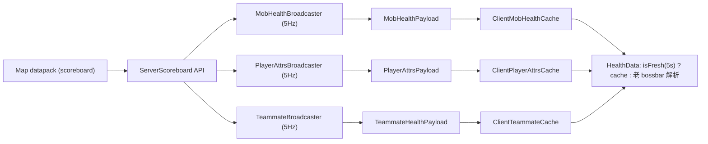

# V8 · 服务端权威数据推送计划

> 版本范围：v8.3.0（M7）→ v8.4.0（M8）→ v8.5.0（M9）
> 创建日期：2026-05-01
> **状态更新（2026-05-01）：M7 已落地发布，M8 / M9 经性能评估后暂缓。** 见下方"里程碑状态"一节。
> 背景：玩家反馈"Boss 存在时敌人头顶血条错乱"（[异常.md 问题 4](异常.md)），根因是客户端只能读 vanilla bossbar 的最近一条，Boss 存在时被独占。顺带一次性根治 ViewStats 刷屏与 team bossbar 文本解析等技术债。

---

## 里程碑状态

| 里程碑 | 版本 | 状态 | 备注 |
|--------|------|------|------|
| M7 · 怪物血量 | v8.3.0 | ✅ 已发布 | 直接解决反馈问题 4；服务端 scoreboard 为单一数据源 |
| M8 · 玩家属性 | v8.4.0 | ⏸ 暂缓 | vanilla bossbar 事件驱动已非常高效，轮询方案反而可能回退性能；等真实需求再启动 |
| M9 · 队友血量 | v8.5.0 | ⏸ 暂缓 | 同上；且 teamBar 文本解析已稳定，收益有限 |

M8 / M9 的完整设计（payload / broadcaster / cache / 分叉点 / 回落策略）保留在下方，
后续若需要再启动实施，直接按文档动工即可 —— 设计一次性完成、代码未写，零历史债。

---

## 目标

把以下三个数据源从"客户端解析 bossbar 文本 + `/trigger ViewStats` 聊天回显"迁到"服务端直接读 scoreboard 推送"：

1. **怪物血量**（解决反馈问题 4）
2. **玩家属性**（根治反馈问题 2 · ViewStats 刷屏）
3. **队友血量**（清理 team bossbar 文本解析技术债）

服务端未装 mod 时：三路数据全部自动 fallback 到现有客户端解析路径，行为与今天零差异。

---

## 数据源调研结论（已完成）

通过直接翻阅 CTT datapack 源码确认：**所有需要的字段都是 scoreboard dummy objective**。

关键证据文件：
- [view_stats.mcfunction:14-18](../../Cake%20Team%20Towers%20Chapter%203%20Update%20%234.0.12%20%28The%20Heart%20of%20Otherside%29%20%28Premium%29/datapacks/CakeTeamPack/data/cake_team_tower/function/misc/view_stats.mcfunction) —— 四种心都是 objective
- [scoreboards_part_2.mcfunction:1337/1338/1433/1434](../../Cake%20Team%20Towers%20Chapter%203%20Update%20%234.0.12%20%28The%20Heart%20of%20Otherside%29%20%28Premium%29/datapacks/CakeTeamPack/data/misc/function/scoreboards_part_2.mcfunction) —— `Blood` / `MaxBlood` / `MaxHP` / `RedHearts` 显式注册
- [class_select.mcfunction:873](../../Cake%20Team%20Towers%20Chapter%203%20Update%20%234.0.12%20%28The%20Heart%20of%20Otherside%29%20%28Premium%29/datapacks/CakeTeamPack/data/cake_team_tower/function/floors/scenes/class_select.mcfunction) —— `RedHearts = MaxHP` 满血初始化
- [enemy_dies.mcfunction](../../Cake%20Team%20Towers%20Chapter%203%20Update%20%234.0.12%20%28The%20Heart%20of%20Otherside%29%20%28Premium%29/datapacks/CakeTeamPack/data/cake_team_tower/function/misc/enemy_dies.mcfunction) —— 用 `scores={RedHearts=..0}` 判定敌人死亡，证明**敌人也共用 RedHearts/MaxHP 这套 objective**

### 可用 objective 清单

| 用途 | objective | 适用对象 |
|------|-----------|----------|
| 当前 HP | `RedHearts` | 玩家 + 敌人 |
| 最大 HP | `MaxHP` | 玩家 + 敌人 |
| 灵魂心 | `SoulHearts` | 玩家 |
| 黑心 | `BlackHearts` | 玩家 |
| 蓝心 / 护盾 | `BlueHearts` | 玩家 + 敌人 |
| 碎心 | `CrackedHearts` | 玩家 |
| 负最大 HP | `NegMaxHealth` | 玩家 |
| 当前蓝 | `PureMana` | 玩家 |
| 最大蓝 | `MaxMana` | 玩家 |
| 当前鲜血 | `Blood` | Joey |
| 最大鲜血 | `MaxBlood` | Joey |
| 命数 | `Lives` | 玩家 |
| HP 百分比 | `HealthPercent` | 玩家 |
| 金币 | `Coins` / `CakeCoins` / `KaiCoins` | 玩家 |
| 其他属性 | `Strength` / `AttackSpeed` / `Defence` / `FireArmor` / `Regen` / ... | 玩家 |

`Velocity` / `MaxVelocity`（果冻斯旺专属）调研时未显式搜到，M8 初版 payload 用 `validBitmap` 跳过该字段，若实机测试发现数据对不上再补挖。

**决定性结论**：服务端实现极简——遍历玩家 / 实体调 `scoreboard.getScore(...)` 即可。不需要解析 bossbar、不需要拦截聊天、**`/trigger ViewStats` 机制可以彻底下线**。

---

## 架构总览



### 核心设计决策

- **隐式切换**：每个 cache 内置 `volatile long latestReceivedMs`，`isFresh()` 即 `now - latestReceivedMs < 5000ms`。消费侧优先 cache，过期自动 fallback。断线 / 切服 `reset()` 清零时间戳立即触发 fallback。参照现有 [ClientStatsCache 的 `isIntegrated()` + `latest != null` 双源模式](../src/main/java/com/ctt/healthdisplay/client/ClientStatsCache.java)
- **Payload 模板**：照搬 [StatsSnapshotPayload](../src/main/java/com/ctt/healthdisplay/network/StatsSnapshotPayload.java) —— 首字节 version、末尾 drain slice 保险阀、未来版本双向兼容
- **推送频率 5Hz（每 4 tick）**：HP 实时感与流量开销的折中。4 玩家 × 20 mob × 30 字节 × 5Hz ≈ 12 KB/s/玩家，LAN 轻松
- **不走握手协议**：收到过包就等于服务端有 mod，无需额外的 ClientHello / ServerCapabilities 交换
- **兼容兜底**：[TriggerEchoFilter](../src/main/java/com/ctt/healthdisplay/client/TriggerEchoFilter.java) 保留，防有人手动输 `/trigger`

---

## M7 · 怪物血量管道（v8.3.0）✅ 已发布

### 目标

直接解决反馈问题 4 —— Boss 存在时，vanilla bossbar 被 Boss 独占锁定导致普通怪头顶血条错乱；服务端 scoreboard 不受此限制。

### 新文件

- `network/MobHealthPayload.java`
  - `byte version`
  - `List<Entry { UUID entityUuid, int hp, int maxHp, int blueHearts, boolean targetted, String nameKey }>`
  - per-player 推送

- `server/MobHealthBroadcaster.java`
  - 注册到 `END_SERVER_TICK`，每 4 tick 触发一次
  - 对每个在线玩家：取该玩家 64 格球形范围内的 `LivingEntity`（排除 player 与 armor stand）
  - 每只实体调 `scoreboard.getScore(entity, RedHearts)` 取当前 HP，`MaxHP` 取最大 HP
  - `targetted` 标记由 [已有的 CttHealthDisplay.matchesName + 距离比较逻辑](../src/main/java/com/ctt/healthdisplay/CttHealthDisplay.java) 移植到服务端
  - 按距离排序取最近的 32 条（硬上限，防 payload 膨胀）
  - `ServerPlayNetworking.send(player, payload)`

- `client/ClientMobHealthCache.java`
  - `volatile Map<UUID, MobHealthEntry> latest` + `volatile long latestReceivedMs`
  - 收到包全量替换
  - `isFresh()` / `reset()` / `view()`

### 消费侧分叉

- [HealthData.java:80 `getMobHealthMap()`](../src/main/java/com/ctt/healthdisplay/health/HealthData.java) 顶部加一行：
  ```java
  if (ClientMobHealthCache.isFresh()) return ClientMobHealthCache.view();
  ```
- [CttHealthDisplay.updateMobTracking](../src/main/java/com/ctt/healthdisplay/CttHealthDisplay.java) 在 `ClientMobHealthCache.isFresh()` 时整个方法短路（避免双路重复填同一 Map）
- [TeammateWorldRenderer.renderMobHealthBar](../src/main/java/com/ctt/healthdisplay/hud/TeammateWorldRenderer.java) 零改动 —— 它只读 `HealthData.getMobHealthMap().get(uuid)`

### 预期

Boss 存在时**所有怪物头顶血条都准确显示**。服务端未装 mod 时行为与今天完全一致。

### 实施结果（v8.3.0）

- 实际实现与计划一致，唯一偏差：payload 未带 `blueHearts`，初版先用 `RedHearts/MaxHP` 双字段搞定主线问题；`nameKey` 实际用的是 `entity.getDisplayName().getString()` + `nameColor`（ARGB），让客户端一步到位拿到渲染需要的所有字段，不需要跨端查表
- 差量推送：上次与本次 entry 列表逐项相同时不重发包；视野内无 CTT mob 时仅在第一次转为空时发一次空包，稳态静默
- 扫描半径从计划的 64 调整为 48 格（≈ vanilla 默认实体同步上限），更贴合真实可见距离
- 触发频率保留 4 Hz（每 5 tick），与计划一致

---

## M8 · 玩家属性管道（v8.4.0）⏸ 暂缓

### 目标

- 消除 `/trigger ViewStats` 刷屏的根源（根治问题 2）
- 属性栏从"每 30 秒自动刷新一次"变成 5Hz 实时

### 新文件

- `network/PlayerAttrsPayload.java` —— 单个玩家的属性集合

  字段：

  | 分组 | 字段 |
  |------|------|
  | 心数 | `red / soul / black / blue / cracked / negMax` |
  | HP 系 | `maxHp / healthPercent / lives` |
  | 蓝 | `pureMana / maxMana` |
  | 血 | `blood / maxBlood` |
  | 杂 | `coins` |
  | 战斗属性 | `strength / attackSpeed / defence / fireArmor / waterArmor / regen / healing / healPercent` 等（与 [StatsData 现有字段](../src/main/java/com/ctt/healthdisplay/health/StatsData.java) 对齐） |
  | 有效位 | `byte validBitmap` 标记哪些字段有效（覆盖 Joey 才有 Blood 等职业差异） |

- `server/PlayerAttrsBroadcaster.java`
  - `END_SERVER_TICK` 每 4 tick 触发
  - 对每个在线玩家读上述 objective 各一次
  - 组包后 `ServerPlayNetworking.send(player, payload)`（per-player 只发自己一份，隐私 + 流量双节省）

- `client/ClientPlayerAttrsCache.java` —— 单例缓存当前玩家的最新 payload

### 消费侧分叉

- [HealthData.update()](../src/main/java/com/ctt/healthdisplay/health/HealthData.java) 开头：
  ```java
  if (ClientPlayerAttrsCache.isFresh()) {
      applyServerAttrs(ClientPlayerAttrsCache.latest());
      // M9 前仍需 parseBossBarData(client) 拿队友条和怪 bar
      return;
  }
  ```
- [StatsData.java](../src/main/java/com/ctt/healthdisplay/health/StatsData.java) 的聊天文本解析仅在 `!ClientPlayerAttrsCache.isFresh()` 时跑
- [CttHealthDisplay.triggerViewStats](../src/main/java/com/ctt/healthdisplay/CttHealthDisplay.java) 开头加短路：`if (ClientPlayerAttrsCache.isFresh()) return;`
- 同理 [maybeAutoTogglePartyBossbar](../src/main/java/com/ctt/healthdisplay/CttHealthDisplay.java) 在 cache 新鲜时短路

### 副作用 · 问题 2 根治

服务端有 mod 时，客户端**完全不再发** `/trigger ViewStats`，也就不会有任何命令回显可供刷屏。[TriggerEchoFilter](../src/main/java/com/ctt/healthdisplay/client/TriggerEchoFilter.java) 降级为"兜底防手动输入"（玩家自己敲指令时依然会被屏蔽）。

---

## M9 · 队友血量管道（v8.5.0）⏸ 暂缓

### 目标

消除对 team bossbar 文本正则的依赖，支持无 team bar 的场景也能显示队友状态。

### 新文件

- `network/TeammateHealthPayload.java`
  - `List<Entry { UUID uuid, String name, int hp, int maxHp, int lives, boolean isSelf }>`

- `server/TeammateBroadcaster.java`
  - 服务端用 `tag=CTT`（见 datapack 里大量 `@a[tag=CTT]` 选择器）识别战斗中的玩家，或读玩家所在 scoreboard team
  - 每 4 tick 打包推送

- `client/ClientTeammateCache.java`

### 消费侧分叉

- [HealthData.parseTeamBar](../src/main/java/com/ctt/healthdisplay/health/HealthData.java) 外层 guard：
  ```java
  if (ClientTeammateCache.isFresh()) { applyFromCache(); return; }
  ```
- [HealthBarRenderer](../src/main/java/com/ctt/healthdisplay/hud/HealthBarRenderer.java) 与 [TeammateWorldRenderer.renderHealthBar](../src/main/java/com/ctt/healthdisplay/hud/TeammateWorldRenderer.java) 零改动（都只读 `HealthData.getTeammateMap()`）

---

## 前置工程工作（共用）

三期第一次动工时一次性做完，之后 M7 / M8 / M9 复用：

1. **服务端公共工具 `server/ScoreboardReader`**
   `int readOrZero(Entity entity, String objective)`，封装 `scoreboard.getNullableObjective + getScore` 的 null 防御，避免每个 broadcaster 重写一遍
2. **Freshness 约定**
   每个 Cache 类自己写 3 行 `isFresh()`（不抽基类，避免空壳 interface）
3. **CttStatsServer.onInitialize 追加三个**
   `PayloadTypeRegistry.playS2C().register(...)` + `ServerTickEvents.END_SERVER_TICK.register(...)`
   对称于现有的 StagePayload / StatsSnapshotPayload 注册点
4. **CttHealthDisplay.onInitializeClient 追加三个**
   `ClientPlayNetworking.registerGlobalReceiver(...)` + DISCONNECT 钩子清 cache
   对称于现有的 StagePayload / StatsSnapshotPayload 接收注册

---

## 风险与未决

- **per-player 视野过滤的怪物 UUID 与客户端实体 UUID 对齐**
  服务端 ServerWorld 与客户端 ClientWorld 实体 UUID 一致（Minecraft 原生保证），但刚 spawn 还没同步完的 tick 客户端拿不到实体，表现为"头顶血条晚 1-2 tick 出现"，可接受

- **部分职业属性可能没有 scoreboard**
  例如 `Velocity` 果冻斯旺独有，首次没搜到。M8 初版通过 `validBitmap` 降级：服务端缺字段 → 对应 bit = 0 → 客户端该字段仍走老 bossbar 文本解析（复合路径：cache 填一部分，老路径填另一部分）。或继续挖 datapack 确认

- **payload 大小**
  MobHealth 在玩家附近怪物多时可能膨胀。对每包设 hard cap 32 条，按距离排序取最近的

- **频率 5Hz 对专用服务器 CPU**
  3 个 broadcaster × 5Hz = 每秒 15 次扫描，每次 O(在线玩家 × 视野实体 × 字段数)。预估 10 玩家服务器 < 1 ms/tick

- **M9 的"谁是队友"判定**
  依赖地图约定（`tag=CTT` 或 scoreboard team）。若未来地图调整 tag 体系需同步更新。最坏降级为"仅搬移原 teamBar 文本解析位置到服务端"，收益降低但仍可用

---

## 发布节奏

- **M7（v8.3.0）先发** —— 用户直接能看见的修复（问题 4）
- **M8（v8.4.0）次之** —— 体感提升大（属性栏更实时 + 聊天框彻底干净 + 根治问题 2）
- **M9（v8.5.0）最后** —— 最难测的部分（"谁是队友"最依赖地图约定），放在前两期验证完隐式切换机制稳定后再做

每期独立构建发布、独立回滚。服务端未装 mod 的老用户**任何一期都无感**。

---

## Todos

| ID | 内容 | 状态 |
|----|------|------|
| m7-payload | M7 · 定义 MobHealthPayload；CttStatsServer 与 CttHealthDisplay 两端注册 playS2C | ✅ done (v8.3.0) |
| m7-server | M7 · MobHealthBroadcaster：4Hz per-player 推送，48 格视野过滤，读 RedHearts/MaxHP scoreboard，按距离排序 + 32 条上限 + 差量 | ✅ done (v8.3.0) |
| m7-client | M7 · ClientMobHealthCache + isFresh(5s)；HealthData.getMobHealthMap 顶部分叉；CttHealthDisplay.updateMobTracking 在 isFresh 时短路 | ✅ done (v8.3.0) |
| m7-release | M7 · 构建发布 v8.3.0 → 实机测试：Boss 场景头顶血条 & 服务端未装 mod 的老行为 | ✅ done (v8.3.0) |
| common-tooling | 共用 · ScoreboardReader.readOrZero 工具类（null 防御） | ✅ done (v8.3.0) |
| m8-payload | M8 · PlayerAttrsPayload：心数 / HP 系 / mana / blood / coins / lives + validBitmap 标记专属字段 | ⏸ 暂缓 |
| m8-server | M8 · PlayerAttrsBroadcaster：5Hz 遍历在线玩家，读 RedHearts/SoulHearts/BlackHearts/BlueHearts/MaxHP/PureMana/MaxMana/Blood/MaxBlood/Lives/HealthPercent/Coins 等，per-player 推自己一份 | ⏸ 暂缓 |
| m8-client | M8 · ClientPlayerAttrsCache；HealthData.update + StatsData.processMessage 分叉；triggerViewStats 与 maybeAutoTogglePartyBossbar 在 isFresh 时短路 | ⏸ 暂缓 |
| m8-release | M8 · 构建发布 v8.4.0 → 确认服务端装 mod 时客户端已彻底不再发 /trigger ViewStats 且属性栏更实时 | ⏸ 暂缓 |
| m9-payload | M9 · TeammateHealthPayload + broadcaster（用 tag=CTT 或 scoreboard team 识别同队名单） | ⏸ 暂缓 |
| m9-client | M9 · ClientTeammateCache + HealthData.parseTeamBar 分叉 | ⏸ 暂缓 |
| m9-release | M9 · 构建发布 v8.5.0 → 验证全套服务端权威模式 + 老行为完整保留 | ⏸ 暂缓 |
